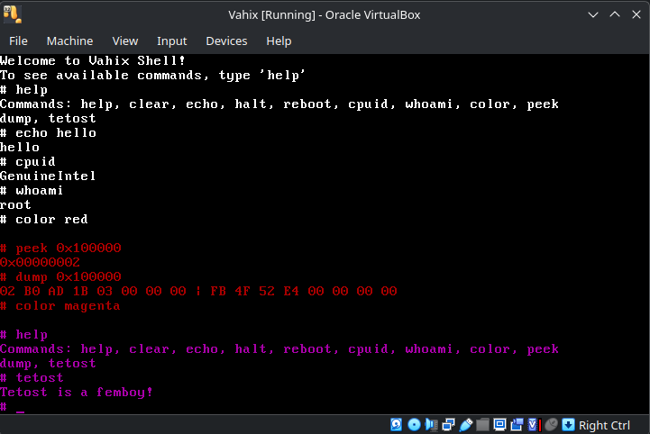

# Vahix

## Vahix is an experimental kernel.

## Layout
- `src/arch/i386` — boot code and architecture-specific startup
- `src/kernel` — kernel entry point and shell
- `src/drivers` — device helpers (keyboard, VGA text)
- `src/lib` — freestanding libc-style utilities
- `include` — public headers mirrored to the source layout
- `iso/boot` — GRUB config and the staged `kernel.bin` for ISO creation
- `docs` — static site assets
- `build` — generated object files (gitignored)

## Build

Requirements:
- `i686-elf-gcc` cross compiler
- `grub-mkrescue`

Commands:
- `make` builds `kernel.bin`
- `make iso` creates `Vahix.iso`
- `make clean` cleans binaries
